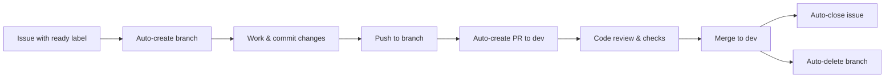

# Contributing to ASO Skill

Thank you for your interest in contributing! This guide will help you understand our workflow and get started quickly.

## Quick Start

1. **Find or create an issue** describing the work
2. **Label it "ready"** → automatic branch creation
3. **Work on the branch** → push changes
4. **Automatic PR creation** to `dev` branch
5. **Code review** (Claude Code + human review)
6. **Merge** → automatic issue close + branch deletion

## Development Workflow

### 1. Issue → Branch → PR → Merge



**Our system automates:**
- Branch creation when issue labeled "ready"
- PR creation when you push to working branch
- Issue closure when PR merges
- Branch deletion after merge

### 2. Branch Naming Convention

Branches are automatically created with this format:
- `feature-{issue-number}-{slug}` for enhancements
- `fix-{issue-number}-{slug}` for bugs
- `docs-{issue-number}-{slug}` for documentation

**Example:** `feature-42-trending-keywords-analysis`

### 3. Branch Protection

**Protected Branches:**
- `main` - Production releases only (from `dev`)
- `dev` - Staging for features (from working branches)

**Rules:**
- All changes must go through PRs
- Require 1+ approval before merge
- All quality checks must pass
- No force pushes
- No direct commits

## Code Standards

### Python Style (Ruff)

We use [Ruff](https://docs.astral.sh/ruff/) for linting and formatting.

**Run before committing:**
```bash
# Install ruff
pip install ruff

# Check linting
ruff check app-store-optimization/

# Fix auto-fixable issues
ruff check --fix app-store-optimization/

# Check formatting
ruff format --check app-store-optimization/

# Auto-format
ruff format app-store-optimization/
```

**Key Rules:**
- Line length: 100 characters
- PEP 8 compliance
- Import sorting (stdlib → third-party → local)
- No unused imports or variables

### ASO-Specific Requirements

**Character Limit Validation:**
```python
# ALWAYS validate platform character limits
APPLE_TITLE_LIMIT = 30
APPLE_SUBTITLE_LIMIT = 30
APPLE_KEYWORDS_LIMIT = 100

GOOGLE_TITLE_LIMIT = 50
GOOGLE_SHORT_DESC_LIMIT = 80
```

**No External Dependencies:**
- Use Python standard library only
- Current modules: `typing`, `re`, `collections`, `json`, `urllib`, `datetime`, `random`, `math`, `statistics`
- If you need new functionality, implement it or justify the dependency

**Platform-Specific Logic:**
- Separate Apple App Store and Google Play Store logic
- Test both platforms for any metadata changes
- Document platform differences in docstrings

### Code Structure

**Function Docstrings:**
```python
def optimize_title(title: str, platform: str, max_length: int) -> str:
    """
    Optimize app title for platform character limits.

    Args:
        title (str): Original app title
        platform (str): Platform ('apple' or 'google')
        max_length (int): Maximum characters allowed

    Returns:
        str: Optimized title within character limit

    Examples:
        >>> optimize_title("My Amazing Fitness App", "apple", 30)
        "My Amazing Fitness App"

        >>> optimize_title("My Super Long Application Name Here", "apple", 30)
        "My Super Long App"
    """
```

**Error Handling:**
```python
# Validate inputs
if platform not in ['apple', 'google']:
    raise ValueError(f"Invalid platform: {platform}. Must be 'apple' or 'google'")

# Handle edge cases
if not title or not title.strip():
    return ""
```

## Testing

### Manual Testing

```bash
# Syntax validation
python -m py_compile app-store-optimization/keyword_analyzer.py

# Run module directly (if has __main__ block)
python app-store-optimization/metadata_optimizer.py

# Test with sample data
python -c "from app-store-optimization.keyword_analyzer import analyze_keyword; print(analyze_keyword('fitness app'))"
```

### Testing Checklist

- [ ] Python 3.8+ compatibility
- [ ] No syntax errors
- [ ] Character limits validated (if metadata changes)
- [ ] Platform-specific logic correct
- [ ] Edge cases handled (empty input, invalid platform, etc.)
- [ ] No external dependencies added

## Documentation

### Update Required Files

**For code changes:**
1. Inline comments for complex ASO logic
2. Docstrings for new/modified functions
3. CHANGELOG.md (following [Keep a Changelog](https://keepachangelog.com/))

**For user-facing changes:**
4. README.md (installation, usage, examples)
5. GitHub Wiki (auto-synced on merge to main)

**CHANGELOG.md Format:**
```markdown
## [Unreleased]

### Added
- New trending keywords analysis in keyword_analyzer.py (#42)

### Changed
- Improved metadata optimization for Google Play (#43)

### Fixed
- Character limit validation for Apple subtitle (#41)
```

## Pull Request Process

### 1. Create PR (Automatic)

When you push to your working branch, a PR is automatically created to `dev`.

### 2. PR Review Process

**Automated Checks:**
- Python quality (ruff linting, syntax validation)
- Security scanning (CodeQL, secret scanning)
- Claude Code review (ASO-specific feedback)
- PR size labeling (XS/S/M/L/XL)

**Human Review:**
- ASO logic correctness
- Character limit validation
- Platform-specific testing
- Documentation completeness

### 3. Required Approvals

- **To dev:** 1 approval + all checks pass
- **To main:** 1 approval + Claude agent check + all checks pass

### 4. Merge Strategy

- Squash or rebase merge preferred (linear history)
- Automatic branch deletion after merge
- Automatic issue closure (if linked)

## Character Limit Quick Reference

| Platform | Field | Limit |
|----------|-------|-------|
| Apple App Store | Title | 30 |
| Apple App Store | Subtitle | 30 |
| Apple App Store | Promotional Text | 170 |
| Apple App Store | Description | 4000 |
| Apple App Store | Keywords | 100 (comma-separated, no spaces) |
| Google Play Store | Title | 50 |
| Google Play Store | Short Description | 80 |
| Google Play Store | Full Description | 4000 |

**CRITICAL:** Always validate these limits in your code!

## Common Tasks

### Add New ASO Function

1. Choose appropriate module (`keyword_analyzer.py`, `metadata_optimizer.py`, etc.)
2. Add function with type hints and docstring
3. Validate character limits (if metadata)
4. Test manually
5. Update CHANGELOG.md
6. Update README.md (if user-facing)

### Fix Bug

1. Create issue using Bug Report template
2. Label issue "ready" → automatic branch creation
3. Fix bug in appropriate module
4. Test fix thoroughly
5. Update CHANGELOG.md
6. Push → automatic PR creation

### Update Documentation

1. Create issue using Documentation template
2. Label issue "ready"
3. Make changes to README.md, CLAUDE.md, or Wiki
4. Push → automatic PR creation
5. Wiki auto-syncs on merge to main

## Quality Gates

### Before PR (Local)
```bash
# Run ruff checks
ruff check app-store-optimization/
ruff format --check app-store-optimization/

# Syntax validation
python -m py_compile app-store-optimization/*.py
```

### Before Merge (Automated)
- All GitHub Actions checks pass
- Claude Code review completed
- 1+ human approval
- No merge conflicts

### Before Main (Extra)
- Claude agent minimal check
- CHANGELOG.md updated
- Version bumped (for releases)

## Getting Help

- **Questions:** [GitHub Discussions](https://github.com/alirezarezvani/claude-code-aso-skill/discussions)
- **Bugs:** [Bug Report template](https://github.com/alirezarezvani/claude-code-aso-skill/issues/new/choose)
- **Features:** [Feature Request template](https://github.com/alirezarezvani/claude-code-aso-skill/issues/new/choose)
- **Docs:** [GitHub Wiki](https://github.com/alirezarezvani/claude-code-aso-skill/wiki)

## License

By contributing, you agree that your contributions will be licensed under the MIT License.

## Code of Conduct

Please read and follow our [Code of Conduct](CODE_OF_CONDUCT.md).

---

**Questions?** Open a [discussion](https://github.com/alirezarezvani/claude-code-aso-skill/discussions) or comment on an issue.
